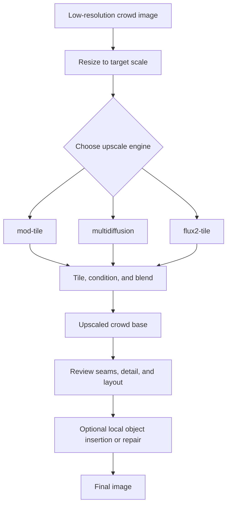

# find-alan

Experiments for diffusion upscaling low-resolution images with tiled pipelines, a custom MultiDiffusion path, and Flux.2 reference-conditioned tiles.

## Setup

```sh
uv sync
uv sync --extra ml
```

The first real generation downloads model weights from Hugging Face unless they are already cached. Set `HF_TOKEN` for higher Hub rate limits.

## Commands

```sh
uv run find-alan-upscale --help
uv run find-alan-crop-plan --help
```

## How The Upscaling Works

The upscaler has a few separate jobs that are easy to mix together:

1. **Image-to-image denoising** starts from a resized version of the low-resolution input. `--denoising-strength` controls how much noise is added before the model redraws it. Higher values give the model more room to invent new detail.
2. **ControlNet** feeds the source image back into the model as a spatial constraint. It says: keep this composition, these edges, this local texture, and this rough object placement. `--controlnet-strength` controls how strongly that constraint is enforced.
3. **Tiling/MultiDiffusion** is about scale and seams. Large images are too big to denoise in one pass, so the model denoises overlapping latent crops and blends them into one canvas.
4. **Flux.2 reference conditioning** is different from ControlNet. Flux.2 accepts image inputs as reference/context tokens, so the `flux2-tile` engine gives each target crop to Flux.2 as a reference image and asks it to redraw that crop at the same pixel size.

ControlNet and MultiDiffusion solve different problems. ControlNet controls **what the generated image should stay aligned to**. MultiDiffusion controls **how many overlapping windows are combined into a seamless large image**.

For more hallucinated detail, raise `--denoising-strength` and lower `--controlnet-strength`. For a faithful upscale, lower denoising and raise ControlNet strength.

For `flux2-tile`, there is no SDXL ControlNet and no global latent canvas. Faithfulness comes from the per-tile reference image plus the prompt. Seam reduction comes from overlap and gaussian blending.

## Pipeline Diagrams



## Pipelines

### `mod-tile`

Default engine. Uses the Diffusers community tiled super-resolution pipeline with SDXL and ControlNet Tile/Union.

The flow is:

1. Resize the input image to the target scale.
2. Use ControlNet Tile/Union to keep the resized image structure visible to SDXL.
3. Let the community tiled SR pipeline split work into tiles and blend the output.

Best for: quick baselines, stable 4x results, preserving the source layout. It is the safer first pass when you want to check whether the source and prompt are reasonable.

```sh
uv run find-alan-upscale input.png output.png --scale 4
```

### `multidiffusion`

Experimental engine. Runs overlapping latent crops at each denoising step, fuses their noise predictions, and advances the whole latent canvas once per step. This is closer to the original MultiDiffusion idea.

The flow is:

1. Resize the input image to the target scale.
2. Encode that resized image into one large latent canvas.
3. For each denoising step, generate a crop grid over the latent canvas.
4. Run ControlNet and the UNet on every overlapping crop.
5. Blend the predicted noise from all crops with soft weights.
6. Advance the whole latent canvas once with the fused noise prediction.
7. Decode the final latent canvas back to pixels.

ControlNet still runs inside each crop. That means the custom MultiDiffusion engine can still be source-faithful if `--controlnet-strength` is high. The MultiDiffusion part makes the crop fusion more coherent; it does not, by itself, make the model more imaginative.

Best for: testing stronger hallucinated detail, jittered crop fusion, and high-overlap seamlessness. It is much slower than `mod-tile`.

```sh
uv run find-alan-upscale input.png output.png \
  --engine multidiffusion \
  --scale 2 \
  --steps 28 \
  --denoising-strength 0.92 \
  --controlnet-strength 0.45 \
  --guidance-scale 6 \
  --md-tile-size 768 \
  --md-overlap 384 \
  --md-jitter 256
```

### `flux2-tile`

Experimental engine for Flux.2. It does not reuse the SDXL ControlNet or latent MultiDiffusion loop, because Flux.2 is a DiT pipeline with image/reference conditioning. Instead, it:

1. Resizes the input image to the target scale.
2. Splits the resized image into overlapping pixel crops.
3. Sends each crop to Flux.2 as the reference image.
4. Prompts Flux.2 to faithfully redraw that reference crop.
5. Blends the generated crops back together with gaussian weights.

Best for: A100 trials where Flux.2 quality is more important than strict SDXL ControlNet-style fidelity. `--denoising-strength` and `--controlnet-strength` are not used by this engine.

Detailed flow:

1. Open the source image as RGB.
2. Compute the scaled output size and round it to a multiple of 16, matching Flux.2/VAE packing constraints.
3. Resize the source image to that final output size with Lanczos filtering.
4. Round `--flux2-tile-size` up to a multiple of 16 and clamp `--flux2-overlap` so it is smaller than the tile.
5. Build a full-cover crop grid. The grid always includes the top-left and bottom-right bounds, so edge pixels are covered even when the image size is not an exact multiple of the stride.
6. For each crop, cut the resized image and pass that crop to Flux.2 as `image=...` with `height` and `width` set to the crop size.
7. Add a faithfulness instruction to the user prompt, including a reminder to preserve composition, linework, colors, viewpoint, and crowd layout.
8. Generate one tile independently. The engine uses bf16 on CUDA and fp32 on CPU.
9. Convert the generated tile to float RGB and multiply it by a gaussian weight map. The center of the tile contributes more strongly than the edges.
10. Accumulate weighted tile pixels into one output canvas and accumulate the matching weights.
11. Normalize `canvas / weights`, clip to RGB, and save the final image.

The tradeoff is important: because Flux.2 tiles are sampled independently, this engine is simpler than latent MultiDiffusion but has less global coordination. Increase `--flux2-overlap` when seams are visible. Increase `--flux2-tile-size` when objects need more surrounding context. Use `--flux2-jitter` to change the crop alignment in a deterministic seed-controlled way.

Model selection:

- Default: `black-forest-labs/FLUX.2-dev`.
- `--flux2-pipeline auto` selects the Diffusers pipeline from the model id.
- Use `--flux2-pipeline dev` for `Flux2Pipeline`.
- Use `--flux2-pipeline klein` for `Flux2KleinPipeline`.
- Use `--flux2-pipeline klein-kv` for `Flux2KleinKVPipeline`.

```sh
uv run find-alan-upscale input.png output.png \
  --engine flux2-tile \
  --scale 2 \
  --steps 50 \
  --guidance-scale 4 \
  --flux2-tile-size 1024 \
  --flux2-overlap 256 \
  --no-cpu-offload
```

### `crop-plan`

Debug helper. Prints the jittered crop grids used by the custom MultiDiffusion scheduler.

```sh
uv run find-alan-crop-plan --width 320 --height 240 --scale 10 --steps 4
```

## Main Parameters

`--denoising-strength`: higher means more imagined changes; lower means more faithful to the upscaled input.

`--controlnet-strength`: higher pins structure and local texture to the source; lower gives the model more freedom. Yes, ControlNet is one of the main reasons outputs stay similar.

`--guidance-scale`: higher follows the prompt harder, but can overcook details.

`--md-overlap`: higher improves seam consistency but increases runtime.

`--md-jitter`: changes crop alignment between denoising steps, which can reduce repeated tile artifacts.

`--flux2-tile-size`: pixel crop size for `flux2-tile`. Larger tiles give Flux.2 more context, but require more VRAM and time.

`--flux2-overlap`: pixel overlap between Flux.2 tiles. Higher overlap gives the gaussian blend more room to hide seams.

`--flux2-jitter`: optional maximum random tile-grid offset for Flux.2. This is deterministic with `--seed`.

`--flux2-pipeline`: selects the Diffusers Flux.2 pipeline class. `auto` is usually enough unless the model id does not clearly name the variant.

`--flux2-caption-upsample-temperature`: optional Flux.2 prompt upsampling temperature. Leave unset for the local prompt as written.

## Useful Recipes

Faithful baseline:

```sh
uv run find-alan-upscale input.png output.png --engine mod-tile --scale 4 --denoising-strength 0.45
```

More imagined 2x MultiDiffusion:

```sh
uv run find-alan-upscale input.png output.png \
  --engine multidiffusion \
  --scale 2 \
  --steps 28 \
  --denoising-strength 0.92 \
  --controlnet-strength 0.45 \
  --guidance-scale 6 \
  --md-tile-size 768 \
  --md-overlap 384 \
  --md-jitter 256
```

Detailed 4x MultiDiffusion trial:

```sh
uv run find-alan-upscale input.png output.png \
  --engine multidiffusion \
  --scale 4 \
  --steps 24 \
  --denoising-strength 0.85 \
  --controlnet-strength 0.75 \
  --guidance-scale 5 \
  --md-tile-size 1024 \
  --md-overlap 512 \
  --md-jitter 256
```

Use a separate local pass for final object insertion and local corrections.

## Object Insertion

The current upscaling engines should stay focused on making a strong base image. Do not put object-specific language into the global upscale prompt, because it can create false positives or repeated motifs across the crowd.

The object insertion stage should stay separate from global upscaling, but the exact approach is intentionally not fixed yet. It might use masked inpainting, local img2img repair, compositing, or a small engine-specific workflow once the base image quality is clear.

For now, treat the global output as an engine-flexible base image. After choosing the best base, use a local pass around the target region so the object can be inserted or repaired without changing the whole crowd scene.

Avoid running a full-image upscale or redraw after inserting the object, because that could smear it, duplicate it, or change the hiding location.

## Build

```sh
uv build
```
