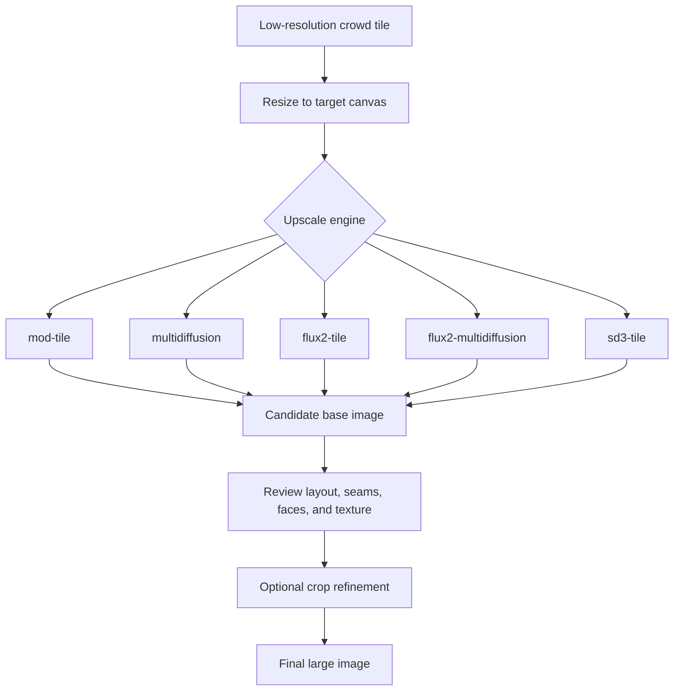
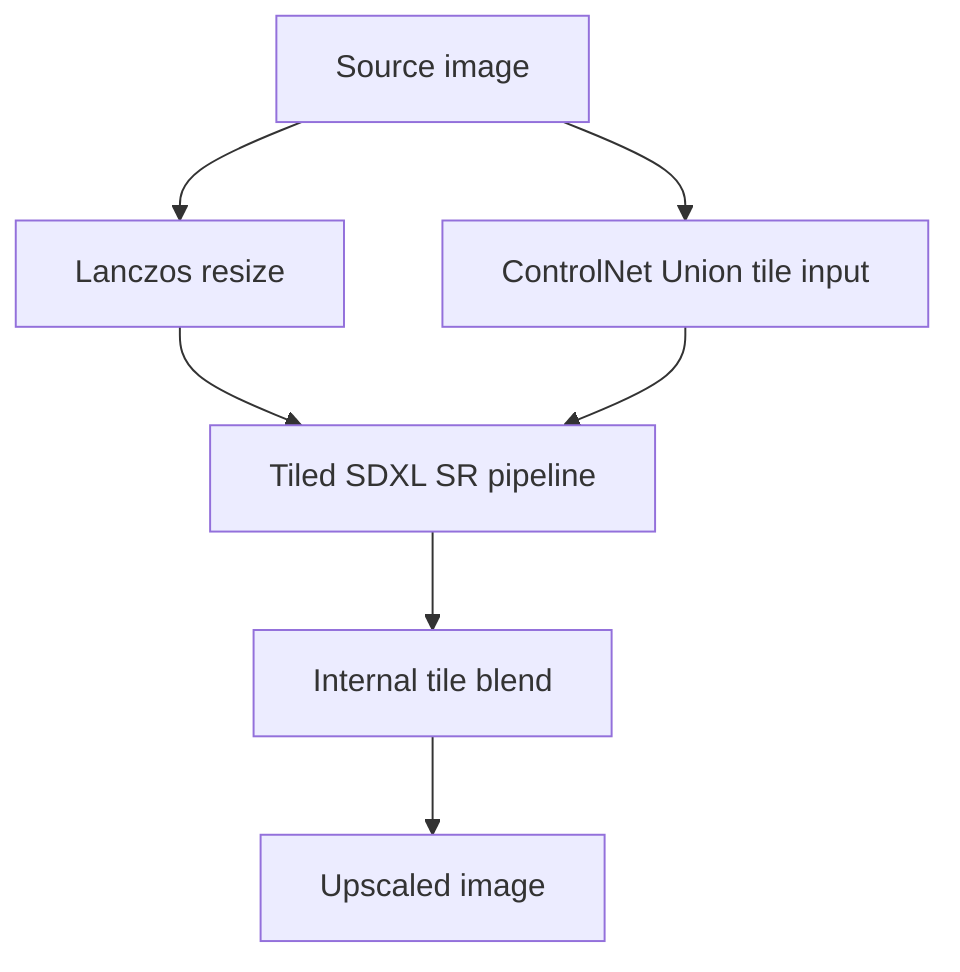
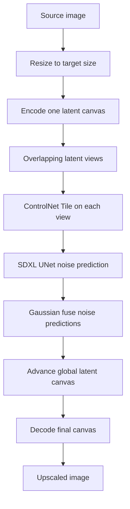
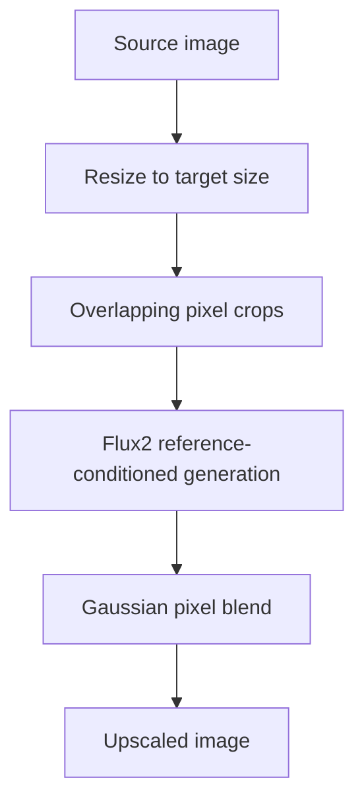
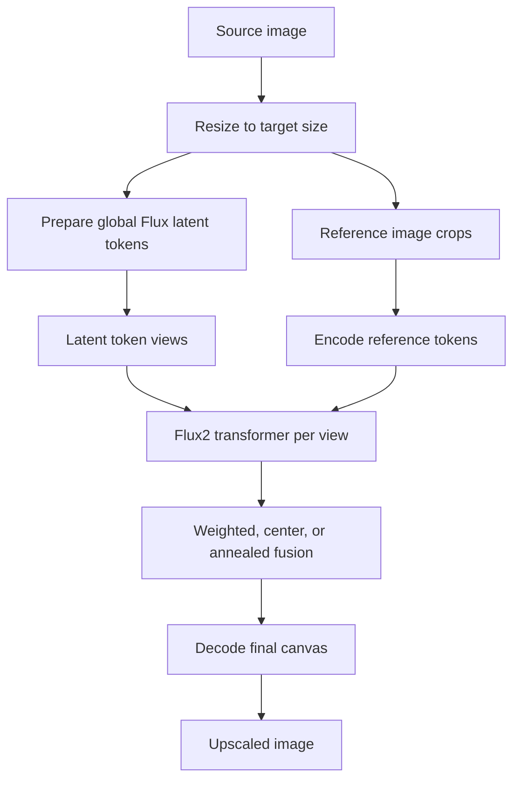
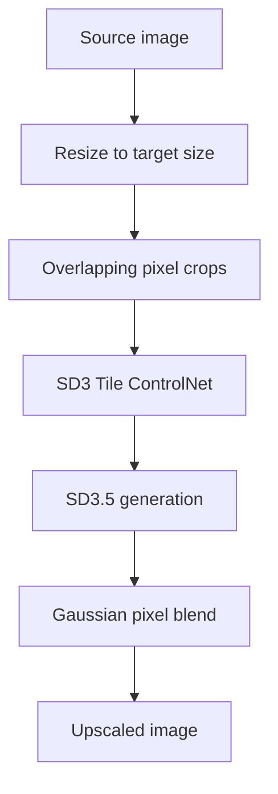
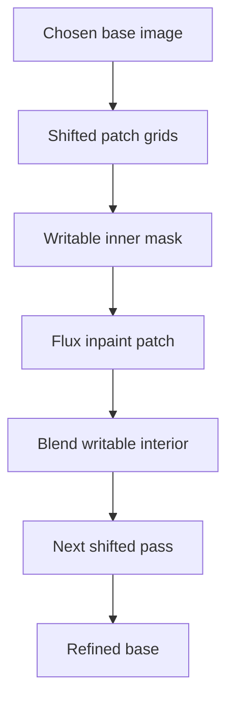

# Upscaler Architectures

This project has several upscaling paths that solve different parts of the
large-crowd problem. The goal is not simply to make a larger image. The useful
base image must preserve the crowd layout, keep seams under control, and avoid
adding texture that later refinement will amplify.

## Current Read

The saved conference experiments suggest this ranking for a 4096 px base:

1. `multidiffusion` with SDXL ControlNet is the strongest current base path.
2. `mod-tile` is the safest faithful baseline.
3. `sd3-tile` preserves layout, but the first SD3.5 result is too grainy.
4. `flux2-multidiffusion` can preserve layout, but it simplifies figures.
5. `flux2-tile` and one-crop Flux2 redraws are not good global base paths.

Blur is easier to repair than grain. A slightly soft base can be improved with
low-strength crop refinement. Grain becomes false linework and is harder to
remove without damaging small figures.

## Shared Pipeline



Every engine starts by resizing the source image to the requested output size.
The differences are how the model sees that resized image, how tiles are fused,
and whether the model has a strong spatial control signal.

## Options

| Approach | CLI engine | Main module | Control signal | Best use | Main failure mode |
| --- | --- | --- | --- | --- | --- |
| SDXL tiled SR | `mod-tile` | `upscale.py` | ControlNet Union tile | Faithful baseline | Can stay too close to blurry resize |
| SDXL latent MultiDiffusion | `multidiffusion` | `experimental_multidiffusion.py` | ControlNet Tile per latent view | Best base candidate | Too much denoise collapses into texture |
| Flux2 pixel tiles | `flux2-tile` | `experimental_flux2_tile.py` | Per-crop image reference | Simple Flux2 comparison | Independent tiles drift or simplify |
| Flux2 latent MultiDiffusion | `flux2-multidiffusion` | `experimental_flux2_multidiffusion.py` | Per-crop image reference tokens | Tests Flux2 global latent fusion | Weak control versus ControlNet |
| SD3.5 tiled ControlNet | `sd3-tile` | `experimental_sd3_tile.py` | SD3 ControlNet Tile per crop | Clean-layout experiment | Grain and stylized texture |
| Tiled refinement | `find-alan-refine` | `refinement.py` | Flux inpaint mask | Local detail repair after base selection | Can amplify grain or invent details |

## `mod-tile`

`mod-tile` uses the Diffusers community tiled super-resolution pipeline with
SDXL and ControlNet Union.



Why it works: ControlNet gives SDXL a strong spatial anchor, so the generated
image remains aligned to the original crowd. This is valuable for puzzle-book
images where the exact placement of many small people matters more than
invented detail.

When to use it: start here for a faithful baseline or when higher-denoise
engines drift. If the output is soft but structurally right, it is still a good
candidate for refinement.

## `multidiffusion`

`multidiffusion` keeps one large latent canvas. At each denoising step, it runs
overlapping latent views through SDXL plus ControlNet Tile, blends the predicted
noise, and advances the whole canvas once.



Why it works: the global latent canvas prevents each tile from becoming a fully
independent image, while ControlNet keeps each view tied to the resized source.
Jittered crop schedules reduce repeated tile artifacts.

When to use it: this is the best current path for a large base. Keep
`--controlnet-strength` high enough to preserve structure. Avoid very low
control or very high denoise on dense crowd images.

Useful starting point:

```sh
uv run find-alan-upscale input.png output.png \
  --engine multidiffusion \
  --scale 2 \
  --steps 28 \
  --denoising-strength 0.75 \
  --controlnet-strength 0.35 \
  --guidance-scale 4.5 \
  --md-tile-size 1024 \
  --md-overlap 512 \
  --md-jitter 256
```

## `flux2-tile`

`flux2-tile` cuts the resized image into pixel crops. Each crop is sent to
Flux2 as an image reference and generated independently. The final image is a
Gaussian blend of the generated crops.



Why it can work: large Flux2 crops have strong local semantic capacity and can
redraw figures in a coherent style.

Why it has failed here: every crop is sampled independently. The prompt and
reference crop are not as strong as ControlNet for exact line-art preservation.
Large or single crops tend to redraw the scene rather than super-resolve it.

When to use it: keep it as a comparison path or for local experiments. Do not
use it as the main global route unless future results beat SDXL ControlNet.

## `flux2-multidiffusion`

`flux2-multidiffusion` is closer to true MultiDiffusion for Flux2. It builds a
global Flux latent canvas, runs crop views through the transformer, fuses the
view predictions, and decodes once at the end.



Why it can work: fusing view predictions is more coherent than pixel-blending
independent Flux2 images.

Why it is still limited: the conditioning is still image-reference conditioning,
not ControlNet. The saved results preserve layout better than `flux2-tile` but
simplify small faces and figures.

When to use it: test Flux2-specific ideas such as fusion mode or position
encoding. Do not use it as the default base path for the conference image.

## `sd3-tile`

`sd3-tile` uses `StableDiffusion3ControlNetPipeline` with SD3.5 Large and the
InstantX SD3 Tile ControlNet. It is a pixel-tiled ControlNet redraw, then a
Gaussian pixel blend.



Why it can work: unlike Flux2 tile, SD3 has a ControlNet tile model, so it can
preserve the source layout while using a stronger modern DiT model.

Why the first result was grainy: the default SD3 guidance was effectively too
strong for clean line art, and the prompt encouraged high-frequency detail. The
engine now passes `--guidance-scale` and exposes SD3 control guidance start/end,
so the next run can reduce prompt pressure and stop ControlNet before the final
cleanup steps.

Recommended next trial:

```sh
uv run find-alan-upscale input.png output.png \
  --engine sd3-tile \
  --scale 2 \
  --steps 24 \
  --guidance-scale 3.0 \
  --controlnet-strength 0.85 \
  --sd3-control-guidance-end 0.85 \
  --sd3-tile-size 1024 \
  --sd3-overlap 384 \
  --prompt "clean flat-color puzzle-book crowd illustration, crisp black ink outlines, solid colors, white background, faithful layout, no shading, no texture" \
  --negative-prompt "grain, noisy, speckled, stippled, hatching, watercolor, painterly, dirty paper texture, soft focus, muddy faces"
```

Small matrix:

| Parameter | Values |
| --- | --- |
| `--guidance-scale` | `2.5`, `3.5` |
| `--controlnet-strength` | `0.7`, `0.85`, `1.0` |
| `--sd3-control-guidance-end` | `0.75`, `0.85` |
| `--steps` | `18`, `24` |

Do not increase SD3 tile size until the grain problem is solved.

## Tiled Refinement

The refinement stage is not a global upscaler. It is a post-process for a base
image that already has the right layout.



Why it works: each patch has local context but only writes to its inner region,
so seams are reduced and the model can repair faces or outlines without
redrawing the whole crowd.

When to use it: after selecting the least-damaging global base. Use low
strength first, especially for dense small figures.

```sh
uv run find-alan-refine base.png outputs/refined \
  --iterations 2 \
  --strength 0.16 \
  --steps 24 \
  --outer-size 512 \
  --inner-ratio 0.5
```

## Practical Strategy

For 4096 px and above:

1. Build a faithful base with `multidiffusion` or `mod-tile`.
2. Reject outputs with grain, repeated texture, or scene-level redraw.
3. Accept mild blur if layout and colors are right.
4. Run low-strength tiled refinement on the chosen base.
5. For 8192 to 10000 px, prefer progressive stages over one huge redraw.

For the conference image specifically, the next useful work is:

1. Patch-tested SD3.5 clean-line matrix.
2. SDXL `multidiffusion` around the existing `d075_c035` result.
3. Low-strength refinement on the best SDXL base.
4. Only revisit Flux2 if testing position encoding or fusion research.
